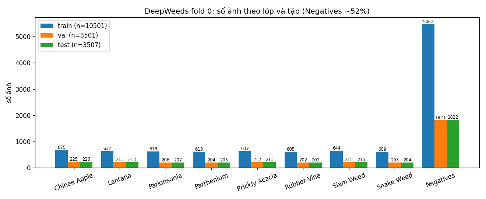
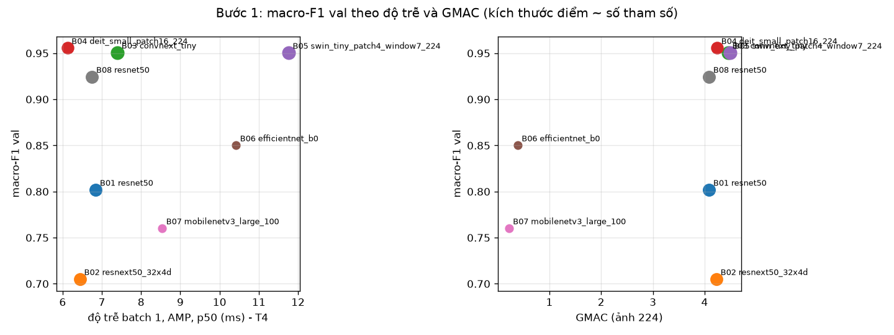
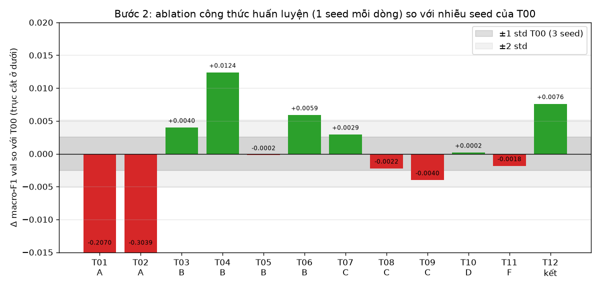
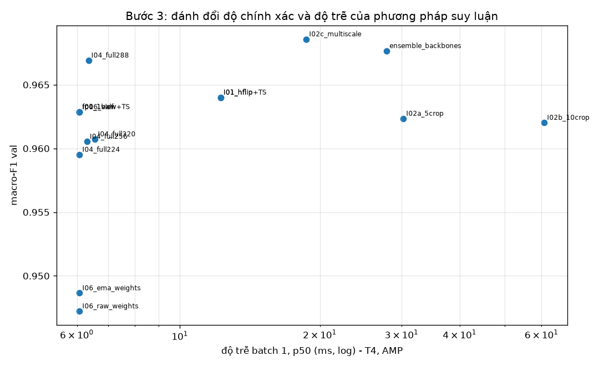
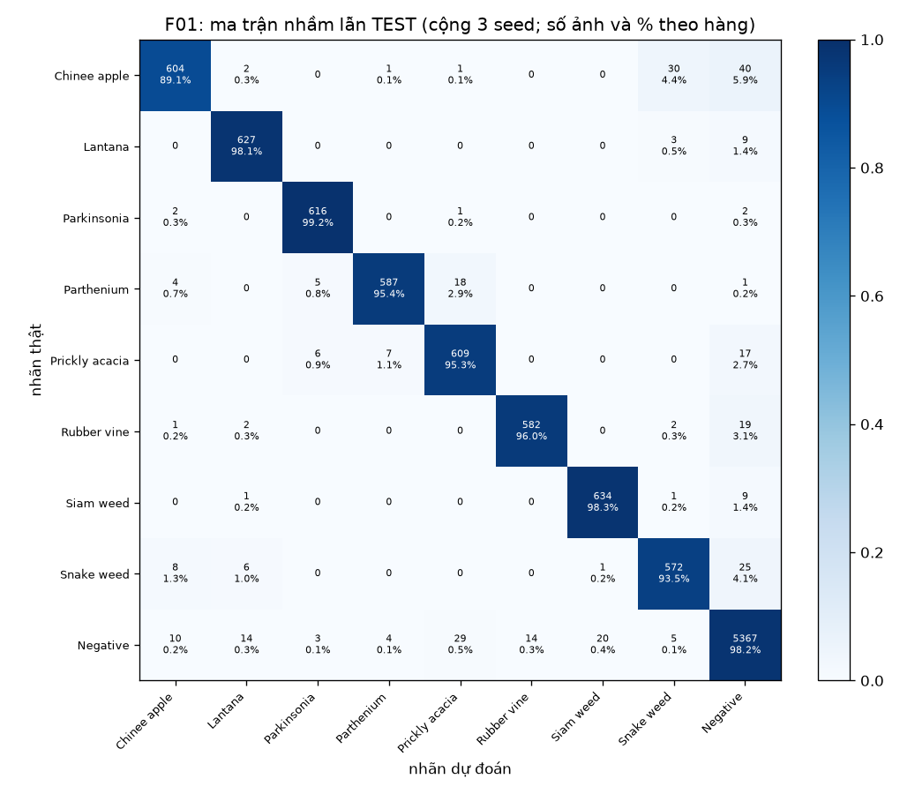
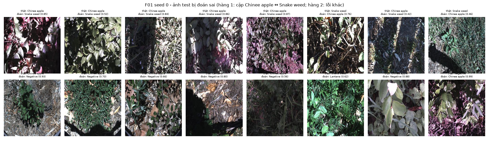

# Báo cáo Lab Day 2 — Backbone, công thức huấn luyện và suy luận trên DeepWeeds

**Hoàng Quốc Việt — MSSV 2A202602563.** Mọi con số dưới đây đến từ các phiên Kaggle ghi trong [`README.md`](README.md),
có trong [`results.xlsx`](results.xlsx) (và `numbers.json`), truy ngược được tới `exp_id` → `curves/<exp_id>_*.png` và
log trong `code/executed/`. Số test được tính lại bằng `eval.py` của repo từ `predictions/`.

## 1. Tóm tắt

- **Bài toán:** phân loại 9 lớp DeepWeeds, fold 0 chia sẵn (train 10.501 / val 3.501 / test 3.507), chỉ số chính
  macro-F1. Mọi lựa chọn làm trên val; test chạy đúng một lần cho mỗi seed ở bước cuối.
- **Đã làm:** 8 backbone (B01–B08) cùng công thức nền; 11 ablation một-yếu-tố trên 5 trục (khởi tạo, augmentation,
  loss, cân bằng mẫu, EMA) + 1 kết hợp (T12); 9 nhóm phương pháp suy luận trên val (TTA lật, 5/10 crop, đa tỉ lệ, gộp
  xác suất vs logit, dò độ phân giải, ensemble seed/backbone, EMA, temperature scaling, FP16, gộp BN) với độ trễ
  p50/p95/p99 trên Tesla T4.
- **Cấu hình tốt nhất `F01`:** DeiT-S (`deit_small_patch16_224.fb_in1k`) + công thức nền + **TrivialAugment**, suy
  luận **TTA lật ngang (gộp logit) + temperature scaling**. Test, 3 seed: **macro-F1 0,9605 ± 0,0018**, top-1
  **0,9693 ± 0,0004**, recall Chinee apple 0,891 ± 0,013, Snake weed 0,935 ± 0,010.
- **Mốc `T00`** (DeiT-S, công thức nền, 1-view): macro-F1 test 0,9497 ± 0,0038. **Δ = +0,0108**, bằng khoảng 2,8 lần
  std lớn hơn của hai nhóm (0,0038) → cải thiện thật (3 seed). `eval.py grade`: **19/20** điểm phần I (mất I4a:
  temperature scaling không giảm ECE trên test, xem mục 6).
- **Kết luận:** yếu tố lớn nhất là **backbone kèm bộ trọng số tiền huấn luyện** (macro-F1 val từ 0,705 đến 0,956);
  trong công thức huấn luyện chỉ TrivialAugment thắng rõ nhiễu (+0,012 ≈ 4,8 std); suy luận thêm +0,001 đến +0,006
  trên val. Cấu hình thời gian thực `R01` (cùng model, 1 view, FP16, batch 1): **p95 = 5,15 ms**, macro-F1 test
  0,9565 ± 0,0015.

## 2. Dữ liệu và thiết lập

**Dataset.** DeepWeeds (Olsen et al. 2019), 17.509 ảnh RGB 256×256, 9 lớp. `images.zip` tải từ Zenodo (MD5
`b7b30f96d466fba86016aa5a26606e0f` khớp), `labels.csv` và `train/val/test_subset0.csv` tải nguyên bản từ GitHub của tác
giả, không sửa, không lọc, không gộp val vào train.

**Kiểm tra chia dữ liệu** (`dataset.check_split`, output phiên A):

| Lớp | train | val | test | tổng | Table 1 bài báo |
|---|---|---|---|---|---|
| Chinee apple | 675 | 225 | 226 | 1.126 | 1.125 |
| Lantana | 637 | 213 | 213 | 1.063 | 1.064 |
| Parkinsonia | 618 | 206 | 207 | 1.031 | 1.031 |
| Parthenium | 613 | 204 | 205 | 1.022 | 1.022 |
| Prickly acacia | 637 | 212 | 213 | 1.062 | 1.062 |
| Rubber vine | 605 | 202 | 202 | 1.009 | 1.009 |
| Siam weed | 644 | 215 | 215 | 1.074 | 1.074 |
| Snake weed | 609 | 203 | 204 | 1.016 | 1.016 |
| Negatives | 5.463 | 1.821 | 1.822 | 9.106 | 9.106 |
| **Tổng** | **10.501** (59,97%) | **3.501** (20,00%) | **3.507** (20,03%) | **17.509** | 17.509 |

Giao theo tên file train∩val = train∩test = val∩test = **0**; hợp ba tập = **17.509**; 0 file trong CSV thiếu trên đĩa.
Tỉ lệ lệch 60/20/20 dưới 0,05 điểm %. Số đếm khớp Table 1 trừ Chinee apple (+1) và Lantana (−1): nhãn trong
`labels.csv` của tác giả khác Table 1 đúng một ảnh, tổng không đổi.

**EDA.** 

`Negatives` chiếm 52,0%; tỉ lệ lớp lớn nhất / nhỏ nhất = 9.106 / 1.009 = **9,0** (train 5.463 / 605 = 9,0). Một mô
hình luôn đoán `Negatives` đã có top-1 ≈ 0,52 nên top-1 không đủ; mọi lựa chọn dùng macro-F1. Ảnh mẫu 4 ảnh/lớp:
[`figures/eda_samples.png`](figures/eda_samples.png). Nhìn bằng mắt: Chinee apple và Snake weed đều là lá xanh nhỏ lẫn
trong cỏ/đất, chụp ở độ sáng và khoảng cách rất khác nhau, dễ nhầm với nhau; `Negatives` là thực vật bản địa đủ loại
nên giống cả 8 loài. Mọi ảnh 256×256, RGB → chuẩn hoá theo mean/std ImageNet (đúng `pretrained_cfg` của cả 8 bộ trọng số).

**Kiểm tra pipeline** (phiên A, `out/pipeline_checks.json`, notebook `code/executed/lab_day2_executed_A.ipynb`):

1. **Loss CE ban đầu** trên 512 ảnh val so với ln 9 = 2,197. Với khởi tạo head **mặc định của timm**: ResNet-50 2,180,
   ResNeXt-50 2,224, ConvNeXt-T 2,278, DeiT-S 2,154, Swin-T 2,431, nhưng **EfficientNet-B0 5,630 và MobileNetV3-L 6,392**
   (head hai mạng này khởi tạo uniform ±1/√9 nên logit ban đầu quá lớn). Vì vậy mọi backbone dùng chung khởi tạo head
   `trunc_normal(std=0,01)`, bias 0; loss ban đầu còn 2,096–2,265 cho cả 7 mạng.
2. **Overfit 16 ảnh** train (ResNet-50, AdamW 3e-4, không augmentation): loss 2,196 → 0,0037 sau 100 bước; accuracy
   eval trên chính 16 ảnh = 1,0.
3. **Ảnh sau augmentation** đã giải chuẩn hoá kèm nhãn: [`figures/aug_samples.png`](figures/aug_samples.png)
   (basic / color / TrivialAugment / RandAugment); CutMix trộn cả ảnh và nhãn, λ theo diện tích thật:
   [`figures/cutmix_samples.png`](figures/cutmix_samples.png).
4. `model.eval()` + `torch.inference_mode()` ở mọi lần đánh giá; khi đóng băng (T01) mọi module ngoài head giữ eval
   (`model.set_train_mode`) để BN không cập nhật thống kê.
5. **Kiểm tra tự viết** `code/test_code.py` (18 test, đều qua): focal γ=0 ≡ CE (sai số < 1e-6); label smoothing ε=0 ≡ CE
   và ε=0,1 khớp `F.cross_entropy(label_smoothing=0.1)`; CutMix: tỉ lệ pixel còn của ảnh gốc đúng bằng λ, nhãn trộn
   đúng; Mixup tuyến tính; norm/bias không bị weight decay; BN ở eval khi đóng băng; lịch LR warmup + cosine; EMA; gộp
   BN (ResNet-18 / EfficientNet-B0 / MobileNetV3, sai số ≤ 1e-5 tương đối); temperature scaling khôi phục T đã biết
   (sai < 5%). Test của repo `python -m unittest discover -s tests`: 38 test OK (trên Windows đặt `PYTHONUTF8=1`).

**Công thức nền `T00`** (GUIDE 1.4): ImageNet-1k pretrained, head mới 9 lớp, tinh chỉnh toàn bộ. Train
`RandomResizedCrop(224, scale 0,08–1)` + lật ngang; val/test `CenterCrop(224)` từ ảnh 256 (không resize). AdamW
(β 0,9/0,999), LR backbone 1e-4 / head 1e-3, weight decay 0,05 cho trọng số ≥ 2 chiều, **0 cho norm và bias** (4 nhóm
tham số). Warmup tuyến tính 1 epoch rồi cosine về 0, cập nhật theo bước. CE. Batch 64 (`drop_last`). **12 epoch**.
AMP FP16 + GradScaler, `channels_last`. Chọn epoch có macro-F1 val cao nhất (hoà lấy epoch sớm hơn); macro-F1 tính
bằng `eval.compute_metrics` của repo. Một hàm `train.run(Config)` cho mọi thí nghiệm.

**Phần cứng, phiên bản, seed.** Kaggle, 2 × Tesla T4 16 GB, 4 vCPU; Python 3.13.15, torch 2.11.0+cu128,
torchvision 0.26.0, timm 1.0.30, CUDA 12.8, cuDNN 9.19. Hai thí nghiệm chạy song song (mỗi GPU một tiến trình) nên thời
gian/epoch chỉ so sánh tương đối. Seed 0 cho mọi run Bước 1–2 (cùng seed cho mọi backbone); T00 thêm seed 1, 2; chung
kết seed 0, 1, 2. `cudnn.benchmark=True` nên cùng seed không trùng từng bit (đo được, xem mục 4).

## 3. So sánh backbone (Bước 1, 1 seed, val)

| exp_id | backbone (tag timm) | #params (M) | GMAC | macro-F1 val | top-1 val | best ep | s/epoch | p50 b1 FP32 / AMP (ms) |
|---|---|---|---|---|---|---|---|---|
| B01 | resnet50.a1_in1k | 23,53 | 4,09 | 0,8019 | 0,8535 | 11 | 33,4 | 6,60 / 6,84 |
| B02 | resnext50_32x4d.a1h_in1k | 23,00 | 4,23 | 0,7050 | 0,7855 | 7 | 41,0 | 9,16 / 6,44 |
| B03 | convnext_tiny.fb_in1k | 27,83 | 4,46 | 0,9507 | 0,9626 | 12 | 51,5 | 5,66 / 7,40 |
| **B04** | **deit_small_patch16_224.fb_in1k** | 21,67 | 4,24 | **0,9556** | **0,9674** | 12 | 31,3 | 5,27 / 6,12 |
| B05 | swin_tiny_patch4_window7_224.ms_in1k | 27,53 | 4,49 | 0,9504 | 0,9614 | 10 | 59,7 | 9,57 / 11,76 |
| B06 | efficientnet_b0.ra_in1k | 4,02 | 0,39 | 0,8500 | 0,8835 | 9 | 31,4 | 8,00 / 10,42 |
| B07 | mobilenetv3_large_100.ra_in1k | 4,21 | 0,22 | 0,7601 | 0,8226 | 12 | 21,3 | 6,75 / 8,53 |
| B08 | resnet50.tv_in1k | 23,53 | 4,09 | 0,9244 | 0,9432 | 9 | 36,1 | 6,32 / 6,75 |

GMAC đếm bằng `torch.utils.flop_counter` (FLOPs/2, gồm cả matmul của attention); #params với head 9 lớp. Độ trễ đo lại cô
lập trong phiên C+D (batch 1, warmup 10, 100 lần, `cuda.synchronize` trước/sau, chỉ forward). Đường cong `curves/B0x_*.png`.



- Ba backbone hiện đại DeiT-S, ConvNeXt-T, Swin-T cách nhau ≤ 0,005 macro-F1 — dưới 2 std nhiễu seed đo ở Bước 2
  (0,0026), chỉ 1 seed → **không phân biệt được** về chất lượng. Cả ba hơn rõ ResNet/ResNeXt a1 và hai mạng nhẹ.
- **Chọn DeiT-S** vì trong nhóm dẫn đầu nó rẻ nhất: ít tham số nhất (21,7M), train nhanh nhất (31 s/epoch so với 52 s
  của ConvNeXt-T và 60 s của Swin-T), độ trễ batch 1 thấp nhất (5,27 ms FP32; Swin-T 9,57 ms) và thông lượng batch 32
  cao nhất trong nhóm (1.089 ảnh/s AMP; ConvNeXt-T 645, Swin-T 455). Bước 2 có 14 lần chạy nên chi phí train quan trọng.
- **ResNet-50 a1 (0,80) và ResNeXt-50 a1h (0,71) thấp bất thường.** Hai bộ trọng số này huấn luyện theo *ResNet strikes
  back* (loss BCE, augmentation rất mạnh). Để kiểm tra "do trọng số chứ không do kiến trúc", B08 dùng **cùng kiến trúc
  ResNet-50** với trọng số torchvision (CE, công thức cũ): macro-F1 **0,9244 (+0,12)**. Vậy phần lớn khoảng cách
  ResNet-50 so với ConvNeXt-T đến từ bộ trọng số tiền huấn luyện và cách nó hợp với công thức tinh chỉnh (LR 1e-4,
  12 epoch), không chỉ từ kiến trúc (slide trang 37, 45). Đường cong B01/B02 cho thấy loss val còn cao ở epoch cuối
  (0,44 / 0,65) và giảm chậm: hội tụ chậm, không phải quá khớp. B08 được thêm sau khi xem kết quả val của phiên A
  (chạy cùng phiên B) và không ảnh hưởng lựa chọn backbone.
- Thứ hạng khác ImageNet: trên ImageNet ResNet-50 a1 (~80,4%) ngang DeiT-S (~79,9%) nhưng ở đây kém 0,15 macro-F1.
- **FLOPs không dự đoán được thời gian:** EfficientNet-B0 chỉ 0,39 GMAC nhưng batch 1 chậm hơn DeiT-S 4,24 GMAC
  (8,0 so với 5,3 ms FP32) — ở batch 1 thời gian bị chi phối bởi số kernel (nhiều lớp depthwise nhỏ) chứ không bởi
  FLOPs; ở batch 32 mới thấy lợi thế (1.690 so với 1.089 ảnh/s). Swin-T và ConvNeXt-T cùng ~4,5 GMAC nhưng train chậm
  hơn DeiT-S 1,6–1,9 lần. Ở batch 1, **AMP chậm hơn FP32** với 6/8 mạng (ví dụ DeiT-S 6,12 so với 5,27 ms) do chi phí
  ép kiểu; FP16 thuần (`model.half()`) nhanh nhất (DeiT-S 4,39 ms).
- Hai mạng nhẹ chưa hội tụ trong 12 epoch ở LR 1e-4 (loss val 0,35 và 0,54 ở epoch cuối, F1 vẫn tăng); DeiT-S,
  ConvNeXt-T, Swin-T hội tụ nhanh nhất (F1 ≥ 0,92 từ epoch 4), không quá khớp rõ (loss val giảm đến epoch cuối).

## 4. Công thức huấn luyện (Bước 2, DeiT-S, seed 0, val)

**Nhiễu.** T00 ba seed: 0,9530 / 0,9479 / 0,9505 → **0,9505 ± 0,0026** (top-1 0,9636 ± 0,0024). Thêm hai đối chứng:
B04 và T00 seed 0 cùng cấu hình, cùng seed, cho 0,9556 và 0,9530 (cuDNN không tất định), chênh 0,0026 = 1 std; F01 được
train hai lần với cùng seed (mục 8): 0,9606 / 0,9584 / 0,9548 rồi 0,9619 / 0,9570 / 0,9527. Quy ước: |Δ| ≤ 1 std →
"không phân biệt được"; 1–2 std → tín hiệu yếu; > 2 std → rõ (vẫn chỉ 1 seed). Mỗi dòng khác T00 đúng một yếu tố
(không tham lam theo trục).

| exp_id | trục | khác T00 | macro-F1 val | Δ vs T00 | Δ/std | F1 Chinee | F1 Snake | kết luận |
|---|---|---|---|---|---|---|---|---|
| T00 | nền | — (3 seed) | 0,9505 ± 0,0026 | — | — | 0,904 | 0,895 | mốc |
| T01 | A | đóng băng backbone (linear probe) | 0,7434 | −0,2070 | −80 | 0,653 | 0,665 | kém rõ |
| T02 | A | từ đầu (không pretrained) | 0,6466 | −0,3039 | −118 | 0,504 | 0,524 | kém rõ |
| T03 | B | + ColorJitter(0,3, 0,3, 0,3, 0,05) | 0,9545 | +0,0040 | +1,6 | 0,905 | 0,893 | yếu |
| **T04** | B | **+ TrivialAugmentWide** | **0,9629** | **+0,0124** | **+4,8** | 0,921 | 0,910 | **tốt hơn rõ** |
| T05 | B | + CutMix (α=1) | 0,9503 | −0,0002 | −0,1 | 0,899 | 0,893 | không phân biệt được |
| T06 | B | + Mixup (α=0,2) | 0,9564 | +0,0059 | +2,3 | 0,904 | 0,911 | tốt hơn, sát ngưỡng |
| T07 | C | label smoothing ε=0,1 | 0,9534 | +0,0029 | +1,1 | 0,918 | 0,902 | yếu |
| T08 | C | focal γ=2 | 0,9483 | −0,0022 | −0,9 | 0,898 | 0,900 | không phân biệt được |
| T09 | C | CE trọng số 1/n_c (đếm trên train) | 0,9465 | −0,0040 | −1,6 | 0,898 | 0,901 | yếu (kém hơn) |
| T10 | D | sampler cân bằng lớp | 0,9507 | +0,0002 | +0,1 | 0,927 | 0,912 | không phân biệt được |
| T11 | F | EMA 0,998 (đánh giá bằng trọng số EMA) | 0,9486 | −0,0018 | −0,7 | 0,907 | 0,889 | không phân biệt được |
| T12 | kết hợp | TrivialAugment + Mixup 0,2 + LS 0,1 | 0,9581 | +0,0076 | +2,9 | 0,917 | 0,910 | xem dưới |

(F1 Chinee/Snake của T00 là trung bình 3 seed.) 

- **Khởi tạo (A) là trục mạnh nhất.** Từ đầu kém 0,30, đóng băng kém 0,21. ViT không có thiên kiến quy nạp cục bộ nên
  với ~10k ảnh và 12 epoch học từ đầu rất chậm (loss val 0,72 ở epoch 12, F1 còn tăng: chưa hội tụ; slide trang 32, 53).
  Đóng băng thiếu khớp (loss train 0,57): đặc trưng ImageNet chưa tách được các loài cỏ, phải tinh chỉnh.
- **Augmentation (B).** TrivialAugment là yếu tố duy nhất thắng rõ (+4,8 std); loss val thấp nhất bảng (0,099) dù loss
  train cao gấp đôi T00 (0,097 so với 0,045) — đúng hành vi chính quy hoá. Ảnh ngoài trời có ánh sáng, độ tương phản,
  góc rất khác nhau nên biến đổi màu/hình học mạnh có ích; ColorJitter đơn lẻ chỉ +1,6 std. **CutMix không giúp**: cây
  mục tiêu thường nhỏ, hộp dán dễ che mất nó nên nhãn trộn theo diện tích không còn đúng nghĩa (GUIDE câu hỏi 4). Mixup
  α=0,2 (nhẹ) +2,3 std. Lật dọc không thử riêng (TrivialAugment không có lật dọc).
- **Loss (C).** Không loss nào vượt nhiễu. Focal và CE có trọng số không cải thiện F1 hai lớp khó mà còn làm giảm
  macro-F1; với mất cân bằng 9:1 và backbone tiền huấn luyện mạnh, CE thường đã đủ. Label smoothing tăng loss val
  (0,19, do nhãn mềm) dù F1 không đổi.
- **Sampler cân bằng (D).** Macro-F1 không đổi nhưng F1 Chinee/Snake cao nhất bảng (0,927 / 0,912): lớp hiếm có lợi,
  `Negatives` bị đoán thiếu. Khác loss có trọng số ở chỗ sampler đổi phân phối batch (mỗi lớp xuất hiện đều, ảnh hiếm
  bị lặp lại) thay vì phóng to gradient của từng mẫu hiếm.
- **EMA (F).** Không "miễn phí" ở đây: với 12 epoch và cosine về 0, trọng số cuối đã mượt; EMA 0,998 (chân trời ~500
  bước ≈ 3 epoch) còn nhớ trọng số lúc LR cao. Cùng run, model thường đạt 0,9472, EMA 0,9486 (I06).
- **Kết hợp (T12).** 0,9581 > T00 (+2,9 std) nhưng **thấp hơn T04 đơn lẻ** (0,9629, −0,0048 ≈ 1,9 std): thêm Mixup và
  label smoothing lên TrivialAugment không cộng dồn mà triệt tiêu một phần — cả ba đều là chính quy hoá và 12 epoch
  không đủ cho mức chính quy hoá cao hơn. Chỉ 1 seed nên đây là tín hiệu yếu. Công thức chung kết = T00 + TrivialAugment
  được chốt từ bảng đơn yếu tố trước khi có T12 (mục 8).
- Đường cong (`curves/T*.png`): T00/T03/T04/T06 hội tụ đều, loss val giảm đến cuối; T09 và T10 dao động mạnh hơn giữa
  các epoch (trọng số/sampler phóng đại lớp hiếm); T01 và T02 chưa hội tụ.

## 5. Suy luận (Bước 3, model T04 seed 0, val)

Mọi phương pháp chạy trên **cùng một checkpoint** (T04 seed 0 = công thức chung kết), một lượt qua val tính mọi view từ
ảnh 256 trên GPU. Độ trễ: Tesla T4, batch 1, AMP (FP16 autocast), warmup 10, 100 lần đo, `cuda.synchronize` trước và
sau mỗi lần, chỉ forward (không tính đọc/giải mã ảnh), TTA chạy K forward tuần tự rồi gộp softmax. Đầy đủ ở sheet
`Inference` và `Latency`.

| exp_id | phương pháp | K | macro-F1 val | top-1 val | ECE val | p50 / p95 / p99 b1 (ms) | ảnh/s b32 | chi phí |
|---|---|---|---|---|---|---|---|---|
| I00 | 1 view, CenterCrop 224 | 1 | 0,9629 | 0,9717 | 0,0066 | 6,08 / 6,54 / 7,31 | 1.038 | 1,0× |
| I01 | TTA lật ngang (gộp logit) | 2 | 0,9640 | 0,9729 | 0,0059 | 12,24 / 12,86 / 14,60 | 508 | 2,0× |
| I02a | 5 crop 224 (gộp logit) | 5 | 0,9623 | 0,9717 | 0,0067 | 30,27 / 31,73 / 32,79 | 212 | 5,0× |
| I02b | 10 crop (5 crop + lật) | 10 | 0,9620 | 0,9717 | 0,0037 | 60,85 / 63,19 / 63,52 | 107 | 10,0× |
| I02c | đa tỉ lệ 224/256/288 toàn ảnh | 3 | 0,9686 | 0,9760 | 0,0053 | 18,71 / 20,08 / 21,04 | 248 | 3,1× |
| I03 | I01 / I02a / I02b / I02c gộp **xác suất** | 2–10 | 0,9643 / 0,9626 / 0,9622 / 0,9700 | 0,9732 / 0,9717 / 0,9717 / 0,9771 | 0,0051 / 0,0083 / 0,0045 / 0,0057 | như dòng gộp logit | | |
| I04 | toàn ảnh resize 224 / 256 / 288 / 320 | 1 | 0,9595 / 0,9605 / **0,9669** / 0,9607 | 0,9694 / 0,9709 / 0,9751 / 0,9714 | 0,0103 / 0,0082 / 0,0064 / 0,0070 | 288: 6,36 / 6,78 / 8,15 | 581 (288) | 1,05× |
| I05a | ensemble 3 seed T00 (gộp xác suất) | 3 | 0,9585 | 0,9712 | 0,0105 | ~3× I00 | | 3× |
| I05b | ensemble T04 + ConvNeXt-T + Swin-T | 3 | 0,9677 | 0,9763 | 0,0180 | 27,87 / 29,36 / 29,97 | 214 | 4,6× |
| I06 | EMA vs trọng số thường (run T11) | 1 | 0,9486 vs 0,9472 | 0,9637 vs 0,9614 | 0,0049 vs 0,0084 | = I00 | | 1× |
| I07 | I00 + temperature scaling (T=1,076) | 1 | 0,9629 | 0,9717 | 0,0066 → 0,0052 | = I00 | | 1× |
| I08a | FP16 (`model.half()`) | 1 | 0,9629 | 0,9717 | 0,0063 | 4,35 / 4,61 / 5,65 | 1.171 | 0,7× |
| I08b | gộp BN vào conv (ResNet-50 tv, B08), FP32 | 1 | 0,9244 → 0,9244 | 0,9432 → 0,9432 | 0,0094 → 0,0094 | p50 6,32 → 5,38 | 282 → 282 | |



- **TTA lật (I01)** +0,0011 macro-F1 với gấp đôi độ trễ; đổi nhãn 27 ảnh (14 sai→đúng, 10 đúng→sai): gần như hoà vốn,
  chênh lệch nằm trong nhiễu. **5/10 crop không giúp** (−0,0006 / −0,0009): các crop góc cắt mất phần giữa ảnh nơi cây
  thường nằm. **Đa tỉ lệ (I02c)** tốt nhất trong TTA (+0,0057 gộp logit, +0,0071 gộp xác suất) nhưng đổi 65 nhãn
  (37 sai→đúng, 22 đúng→sai) — TTA không miễn phí.
- **Gộp xác suất vs logit (I03):** khác nhau ≤ 0,0014, không phân biệt được; chọn logit vì temperature scaling khi đó
  là một nhiệt độ duy nhất trên logit trung bình.
- **Dò độ phân giải (I04):** toàn ảnh ở **288** tốt nhất (+0,0040 so với I00) mà gần như không tốn thêm ở batch 1
  (6,36 so với 6,08 ms) — đúng tinh thần FixRes (slide trang 68): `RandomResizedCrop` lúc train làm vật thể to hơn,
  nên test ở độ phân giải cao hơn khớp lại kích thước biểu kiến. 320 lại giảm (nội suy pos-embed của ViT xa lưới 14×14
  lúc train).
- **Ensemble (I05):** 3 seed T00 hơn trung bình từng model +0,008 (0,9585 so với 0,9505); ensemble 3 backbone 0,9677
  nhưng ECE tệ hơn (0,0180: trung bình xác suất làm model bớt tự tin) và tốn 4,6× độ trễ.
- **Hiệu chuẩn (I07):** model đã hiệu chuẩn sẵn tốt (ECE 0,0066), T khớp trên val = **1,076**. ECE trong mẫu
  0,0066 → 0,0052, nhưng ECE **ngoài mẫu** (khớp T trên một nửa val, đo trên nửa còn lại) chỉ 0,0102 → 0,0098: lợi ích
  gần bằng nhiễu ước lượng ECE 15 bin. Điều này báo trước kết quả test ở mục 6.
- **FP16 (I08a):** cùng 3.501 dự đoán như AMP (0 ảnh đổi nhãn, |Δlogit| ≤ 0,02), nhanh nhất ở batch 1 (4,35 ms so với
  5,32 FP32 và 6,08 AMP — AMP chậm hơn FP32 ở batch 1, slide trang 73). **Gộp BN** (DeiT-S không có BN nên thử trên
  ResNet-50 B08): 53 cặp Conv+BN, sai số đầu ra lớn nhất 1,6e-5 (FP32, logit cỡ vài đơn vị), dự đoán không đổi; p50
  batch 1 FP32 6,32 → 5,38 ms, FP16 5,84 → 3,88 ms; batch 32 không đổi (113,7 vs 113,6 ms).
- **Ngoại tuyến vs thời gian thực:** dữ liệu ủng hộ kết luận của slide — TTA đa tỉ lệ và ensemble cho điểm val cao nhất
  nhưng tốn 3–5× độ trễ, hợp xử lý ngoại tuyến; trên robot nên dùng thứ không tốn thêm: FP16, gộp BN (nếu là CNN), độ
  phân giải đã dò (288).

**Quy tắc chọn phương pháp chung kết** (viết sẵn trước khi chạy test, mục 8): dùng I01 nếu macro-F1 val của I01 > I00,
ngược lại I00. Kết quả 0,9640 > 0,9629 → **I01 (TTA lật, gộp logit) + temperature scaling**. I02c và I04-288 tốt hơn
I01 trên val nhưng không nằm trong quy tắc đã chốt (hạn chế, mục 8).

## 6. Cấu hình tốt nhất và kết quả test (Bước 4)

**Cấu hình `F01` (tái lập được):** `deit_small_patch16_224.fb_in1k`, head `trunc_normal(0,01)`; công thức nền mục 2 +
`TrivialAugmentWide` sau `RandomResizedCrop(224)` + lật ngang; 12 epoch, batch 64, AdamW 1e-4/1e-3, wd 0,05 (không cho
norm/bias), warmup 1 epoch + cosine, CE, AMP; checkpoint = epoch có macro-F1 val cao nhất. Suy luận: ảnh 256 →
CenterCrop 224 và bản lật ngang, trung bình logit, chia T (khớp trên val của từng seed: 1,041 / 0,995 / 1,088), softmax.
Lệnh: `run_experiments.py --stage combo` với `{"aug": "trivial", "seed": k}` rồi `final_eval.py --method I01_hflip --ts`.
Test chạy **đúng một lần cho mỗi seed**, một lượt duy nhất cho mọi view (F01, F01_uncal và R01 dùng chung lượt đó).

**Kết quả `eval.py score` (3 seed, 3.507 ảnh test):**

| cấu hình | macro-F1 val | macro-F1 test | top-1 test | balanced acc | ECE test | recall Chinee | recall Snake |
|---|---|---|---|---|---|---|---|
| **F01** (I01 + TS) | 0,9594 ± 0,0047 | **0,9605 ± 0,0018** | **0,9693 ± 0,0004** | 0,9590 ± 0,0022 | 0,0079 ± 0,0011 | 0,891 ± 0,013 | 0,935 ± 0,010 |
| F01_uncal (I01, chưa TS) | — | 0,9605 ± 0,0018 | 0,9693 ± 0,0004 | 0,9590 ± 0,0022 | 0,0070 ± 0,0002 | 0,891 ± 0,013 | 0,935 ± 0,010 |
| R01 (1 view + TS) | 0,9572 ± 0,0046 | 0,9565 ± 0,0015 | 0,9664 ± 0,0021 | 0,9547 ± 0,0063 | 0,0070 ± 0,0015 | 0,873 ± 0,022 | 0,936 ± 0,017 |
| **T00** mốc (nền + I00) | 0,9505 ± 0,0026 | 0,9497 ± 0,0038 | 0,9613 ± 0,0023 | 0,9551 ± 0,0041 | 0,0096 ± 0,0012 | 0,881 ± 0,009 | 0,941 ± 0,020 |

Macro-F1 test từng seed của F01: 0,9622 / 0,9586 / 0,9606 (T00: sheet `Final`). P/R/F1 từng lớp: sheet `PerClass`. Hai
lớp khó của F01: Chinee apple P 0,961 / R 0,891 / F1 0,924; Snake weed P 0,933 / R 0,935 / F1 0,934 (T00: F1 0,915 / 0,919).

- **So với mốc:** Δ macro-F1 = **+0,0108**, s (std lớn hơn) = 0,0038 → Δ ≈ 2,8 s, vượt nhiễu. Phần lớn đến từ
  TrivialAugment (R01 1-view đã 0,9565, +0,0068); TTA lật thêm +0,0040 trên test (cỡ 2 std của R01).
- **Val/test:** chênh 0,0011 (0,9594 vs 0,9605) → không có dấu hiệu quá khớp val.
- **Đối chiếu bài báo** (số trích dẫn, điều kiện khác: ~100 epoch, 5 fold, weighted accuracy): ResNet-50 95,7%; F01 top-1
  96,9% (1 fold, 12 epoch). Recall Chinee apple 89,1% (bài báo 88,5%), Snake weed 93,5% (bài báo 88,8%).
- **Hiệu chuẩn trên test thất bại nhẹ:** ECE sau TS 0,0079 > trước 0,0070. T ≈ 1 (0,99–1,09) vì model vốn đã hiệu chuẩn
  tốt nên TS không còn gì để sửa; T khớp trên val chủ yếu khớp nhiễu của val (đúng như ECE ngoài mẫu ở mục 5 đã báo).
  NLL gần như không đổi (0,0904 → 0,0905). Kết luận trung thực: với model này, temperature scaling **không** cần.

**Ma trận nhầm lẫn** (test, cộng 3 seed; mốc T00 ở `figures/confusion_test_T00.png`):


Cặp nhầm nhiều nhất của F01: **Chinee apple → Negatives** (40 ảnh / 3 seed), **Chinee apple → Snake weed** (30, tức
4,4% ảnh Chinee; bài báo 3,4%), Negatives → Prickly acacia (29), Snake weed → Negatives (25), Negatives → Siam weed (20).
Chiều Snake weed → Chinee apple chỉ 8 (1,3%; bài báo 4,1%). Ở mốc T00 nhiều nhất là Negatives → Lantana (47) và
Chinee → Snake (43): TrivialAugment giảm mạnh nhầm Negatives → Lantana (precision Lantana 0,905 → 0,962).

**Ảnh bị đoán sai** (F01 seed 0: 108 / 3.507 ảnh sai, 11 thuộc cặp Chinee ↔ Snake):


Giả thuyết: ảnh Chinee bị đoán Snake/Negatives thường chụp xa, lá nhỏ chiếm phần nhỏ khung hình, nhoè do chuyển động
hoặc ngược sáng; lá Chinee apple non và Snake weed đều bầu dục, xanh đậm, mọc sát đất, nên khi mất chi tiết mép lá/gân lá
ở 224 px là đủ để nhầm. Nhiều ảnh `Negatives` bị gán là loài cỏ có nền rất giống loài đó — một phần có thể là nhiễu
nhãn của dataset. Độ tin cậy của dự đoán sai thấp hơn hẳn dự đoán đúng (seed 0: trung vị max-softmax 0,68 so với 0,999;
53% ảnh sai có độ tin cậy < 0,7), phù hợp để robot bỏ qua hoặc chụp lại.

## 7. Kết luận và khuyến nghị

- **Cấu hình tốt nhất:** F01 = DeiT-S + TrivialAugment + TTA lật (+TS), macro-F1 test 0,9605 ± 0,0018, top-1
  0,9693 ± 0,0004; hơn mốc T00 +0,0108 (≈ 2,8 std), vượt nhiễu.
- **Yếu tố đóng góp nhiều nhất:** (1) **backbone + bộ trọng số tiền huấn luyện**: chênh 0,25 macro-F1 val giữa các
  backbone; riêng đổi trọng số ResNet-50 a1 → tv đã +0,12; pretrained so với từ đầu +0,30. (2) **Công thức huấn
  luyện**: TrivialAugment +0,012 val (+0,007 test 1-view); loss/sampler/EMA không vượt nhiễu. (3) **Suy luận**:
  +0,001 (lật) đến +0,006 (đa tỉ lệ) val, +0,004 test (lật), đổi lại 2–3× độ trễ.
- **Triển khai trên robot (ngân sách 30–100 ms/khung):** chọn **R01** = model F01, 1 view, FP16, batch 1:
  p50 4,69 / **p95 5,15** / p99 5,94 ms trên T4 (macro-F1 test 0,9565 ± 0,0015). F01 (TTA lật, FP16 p95 10,29 ms) cũng
  vừa ngân sách trên T4; trên Jetson (bài báo: ResNet-50 180 ms TensorFlow, 53 ms TensorRT) nên giữ 1 view + FP16/
  TensorRT, và cân nhắc test ở 288 (I04, gần như không tốn thêm, nhưng mới kiểm trên val, 1 seed). TTA đa tỉ lệ và
  ensemble chỉ dùng ngoại tuyến (lập bản đồ cỏ sau khi robot chạy xong).
- Vì dự đoán sai thường có độ tin cậy thấp và model hiệu chuẩn tốt (ECE < 0,01), có thể đặt ngưỡng max-softmax để
  chuyển ca khó sang chụp lại thay vì phun thuốc.

## 8. Hạn chế và việc tiếp theo

- **Chia ngẫu nhiên, không theo địa điểm:** ảnh cùng địa điểm/lần chụp có thể có ở cả train và test, nên điểm test lạc
  quan so với khi robot gặp địa điểm, mùa, camera mới. Rủi ro lệch phân phối (ánh sáng, mùa khô/mưa, giai đoạn sinh
  trưởng) chưa được đo; T khớp trên val có thể không đúng ở miền mới.
- **Một fold** (fold 0); **ablation 1 seed** (trừ T00); nhiễu ước lượng từ 3 seed là ước lượng thô. Ba backbone dẫn đầu
  không phân biệt được với 1 seed; DeiT-S được chọn vì chi phí, không vì chất lượng.
- **Cắt giảm do thời gian (nộp trễ sau hạn 12:00 ngày 05/10/2026):**
  - 12 epoch thay vì 15; ablation chỉ trên 1 backbone (DeiT-S); không thử trục E (LR/optimizer) và G (độ phân giải/số
    epoch lúc train); không làm phần điểm thưởng.
  - Phiên C (kết hợp + suy luận) và D (chung kết) **gộp thành một phiên Kaggle**. Vì vậy công thức chung kết được chốt
    từ bảng ablation đơn yếu tố **trước** khi có kết hợp T12 (T12 chạy song song chỉ để phân tích), và phương pháp suy
    luận chung kết được chọn bằng **quy tắc viết sẵn chỉ dùng val** (I01 nếu macro-F1 val > I00) chạy tự động trước
    bước test. Quy tắc chỉ so I00 với I01, nên I02c (đa tỉ lệ) và I04-288 — tốt hơn trên val — không được xét. Không có
    lần chạy test nào bị lặp hay dùng để chọn cấu hình.
  - Lần chạy đầu của phiên gộp (`k4-day2-cd-inference-final`) lỗi sau khi đã train F01 và T12 (notebook không tìm thấy
    output của phiên trước vì Kaggle gắn kernel source ở `/kaggle/input/notebooks/<user>/<slug>/`), **trước** mọi bước
    suy luận/test. Các run đó bị bỏ; phiên `k4-day2-cd2-inference-final` train lại F01 và T12 từ đầu với cùng seed rồi mới
    chạy test — mọi số trong báo cáo đến từ phiên thứ hai.
- Thời gian/epoch đo khi 2 job chạy song song (2 GPU dùng chung 4 vCPU), chỉ so sánh tương đối.
- Công thức nền chung (LR 1e-4, 12 epoch) bất lợi cho ResNet/ResNeXt a1 và hai mạng nhẹ (chưa hội tụ); so sánh backbone
  là "cùng công thức", không phải "mỗi backbone ở công thức tốt nhất của nó".
- Cảnh báo `lr_scheduler.step() before optimizer.step()` ở bước đầu mỗi run: GradScaler bỏ qua bước đầu do gradient FP16
  tràn số, nên lịch LR lệch đúng một bước (không đáng kể trên 1.968 bước).
- **Việc tiếp theo:** 5 fold cho F01; xét I02c/I04-288 cho chung kết bằng nhiều seed; chia theo địa điểm nếu có
  metadata; chưng cất DeiT-S → MobileNetV3; kiểm tra độ bền với ảnh tối/mờ/nhiễu; xuất ONNX/TensorRT cho Jetson.

## 9. Phụ lục

**Danh sách thí nghiệm** (cấu hình đầy đủ trong `config.json` của từng run và sheet `Training`; mọi run: fold 0,
12 epoch, batch 64, AMP, ảnh 224; DeiT-S trừ nhóm B):

| exp_id | seed | cấu hình | phiên Kaggle | ảnh |
|---|---|---|---|---|
| B01–B07 | 0 | 7 backbone, công thức nền | A `k4-day2-a-backbones` | `curves/B0x_*.png` |
| B08 | 0 | resnet50.tv_in1k, công thức nền | B `k4-day2-b-ablations` | `curves/B08_resnet50_tv.png` |
| T00 | 0, 1, 2 | DeiT-S, công thức nền (= mốc) | B | `curves/T00_seed*_baseline.png` |
| T01–T11 | 0 | một yếu tố khác T00 (bảng mục 4) | B | `curves/T0x_*.png`, `curves/T1x_*.png` |
| T12 | 0 | trivial + mixup 0,2 + LS 0,1 | C+D `k4-day2-cd2-inference-final` | `curves/T12_trivial_mixup_ls.png` |
| F01 | 0, 1, 2 | DeiT-S + trivial; suy luận I01 + TS | C+D | `curves/F01_seed*_final.png` |
| I00–I08 | — | suy luận trên checkpoint T04 seed 0 (val) | C+D | `figures/inference_tradeoff.png` |
| R01 | 0, 1, 2 | model F01, 1 view + TS (thời gian thực) | C+D | — |

**Notebook:** `code/lab_day2.ipynb` (link Kaggle ở `README.md`); bản đã thực thi trong `code/executed/`.

**Lệnh và output `eval.py grade`** (phiên C+D; chạy lại cục bộ theo README cho cùng kết quả):

```
python eval.py grade --final "predictions/F01_seed*_test.csv" --baseline "predictions/T00_seed*_test.csv" \
    --uncal "predictions/F01_uncal_seed*_test.csv" --final-val "predictions/F01_seed*_val.csv" \
    --val-csv labels/val_subset0.csv --latency-p95-ms 5.15 --latency-method proper \
    --test-csv labels/test_subset0.csv --labels labels/labels.csv
```

| Mã | Tiêu chí | Điểm | Tối đa | Chi tiết |
|---|---|---|---|---|
| I1 | Top-1 accuracy test | 7 | 7 | 96.93% (mean 3 seed) |
| I2 | Macro-F1 cải thiện so với mốc | 5 | 5 | final 0.9605, mốc 0.9497, Δ=+0.0108, s=0.0038 |
| I3 | Recall hai lớp khó | 4 | 4 | Chinee Apple 89.1% (mốc 88.5%), Snake Weed 93.5% (mốc 88.8%) |
| I4a | ECE sau TS < ECE trước | 0 | 1 | trước 0.0070, sau 0.0079 |
| I4b | Chênh macro-F1 val/test <= 0.02 | 1 | 1 | val 0.9594, test 0.9605, chênh 0.0011 |
| I5 | Cấu hình thời gian thực | 2 | 2 | p95 = 5.2 ms (ngân sách 100 ms), đo đúng cách |

**Tổng các ý đã chấm: 19 / 20** (đề xuất; giảng viên xác nhận).
